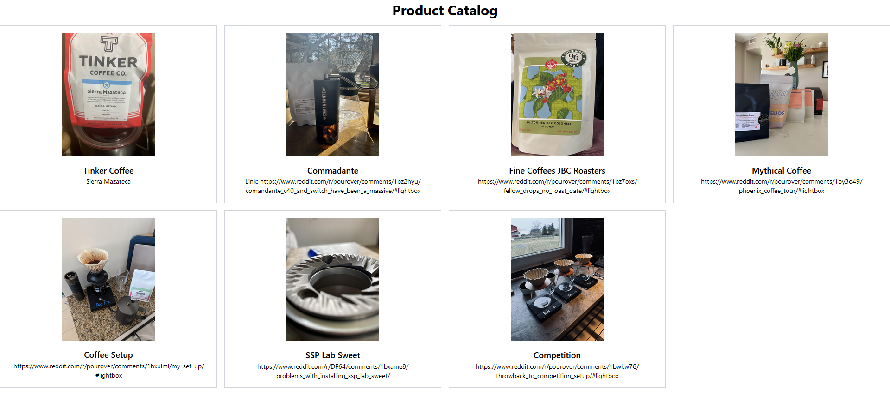

# Image Gallery

Project to learn about Django and uses some Tailwind and html.

## Description

Beginner Project with Django and seeing how to startup a project.

## Installation

* Used django-admin startproject <project_name>
* cd <project_name>
* python manage.py startapp gallery
* required npm and node.js
* installed tailwindcss

## Lessons Learned

* Registering model provides ease of administration tasks
* Quick data management
* The different fields that could be used in the model
* Rendering the probject is used for html files to display on the site
* URLS are used to map the views to URLS
    * Created one for the app, although one was made for the project already
* double {{}} is used for values from the database
* had to create virtual enviroment and run the activate script required for the specific os
 updated settings for static files to use for CSS, javacript and image files
* static files can updated immediately without having to restart a seperate web server
* created a super user to be able to add data into the data base
* makemigrations, migrate, and runserver